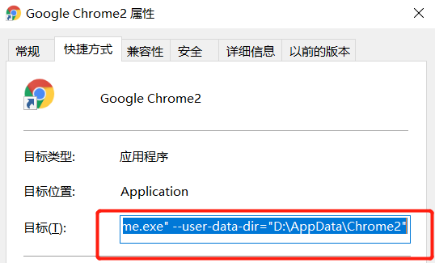
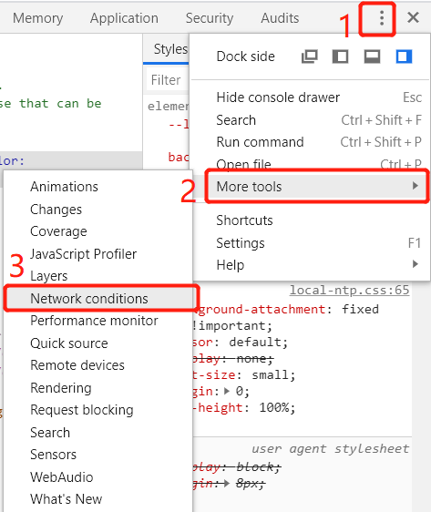
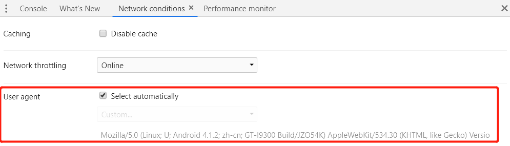
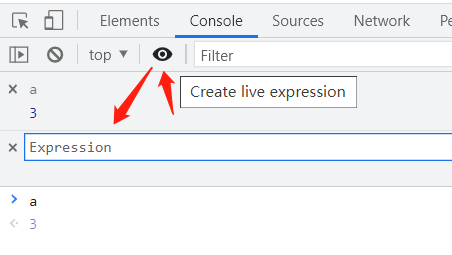

# Chrome


## 开发者工具

打开开发者工具： `F12` 或 `Ctrl + Shift + i` 


## Chrome 浏览器躲开

复制一个Chrome的快捷方式，编辑属性，在【目标(T)】增加：

```bash
 --user-data-dir="D:\AppData\Chrome2"
```

注意：程序的路径，与该语句之间有一个空格




## 修改 user-agent，伪装成其他浏览器

参考来源：https://jingyan.baidu.com/article/20095761d41761cb0621b46f.html 

1，windows上F12，Mac上Alt+Command+I 打开浏览器调试工具。

2，右下角的点点开，选择More tools，展开之后选择Network conditions。



3，下方会打开一个tab。里面是关于浏览器网络的一些设置。是否支持cache，选择什么类型的网络，user-agent等。



4，修改user-agent，可以伪装成其他浏览器。


## Javascript 断点

1. Sources面板打断点

2. debugger 语句：如果能修改要调试的 js 文件，则可以在想要断点的位置加入这个


## console 中发起 Http 请求

参考来源：https://www.cnblogs.com/helloworld3/p/11192376.html

Post 请求

```js
//方法一：
var url = "/dict/test";
var params = {advertiserUid: 1232131, advertiserWeiboNickname: "18"};
var xhr = new XMLHttpRequest();
xhr.open("POST", url, true);
xhr.setRequestHeader("Content-Type", "application/json");
xhr.onload = function (e) {
  if (xhr.readyState === 4) {
    if (xhr.status === 200) {
      console.log(xhr.responseText);
    } else {
      console.error(xhr.statusText);
    }
  }
};
xhr.onerror = function (e) {
  console.error(xhr.statusText);
};
xhr.send(JSON.stringify(params));

//方法二：
var url = "/dict/test";
var params = "score=5&abc=6";
var xhr = new XMLHttpRequest();
xhr.open("POST", url, true);
xhr.setRequestHeader("Content-type","application/x-www-form-urlencoded"); 
xhr.onload = function (e) {
  if (xhr.readyState === 4) {
    if (xhr.status === 200) {
      console.log(xhr.responseText);
    } else {
      console.error(xhr.statusText);
    }
  }
};
xhr.onerror = function (e) {
  console.error(xhr.statusText);
};
xhr.send(params);
```

Get 请求

```js
var url = "/v1/query/listDicts?types=userType,userStatus";
var xhr = new XMLHttpRequest();
xhr.open("GET", url, true);
xhr.onload = function (e) {
  if (xhr.readyState === 4) {
    if (xhr.status === 200) {
      console.log(xhr.responseText);
    } else {
      console.error(xhr.statusText);
    }
  }
};
xhr.onerror = function (e) {
  console.error(xhr.statusText);
};
xhr.send(null);
```


## 监听

参考来源：[Chrome 70-71 Live Expression 及 global variable 功能](https://cloud.tencent.com/developer/article/1376545)

### 监听变量

Live Expression

Chrome70起，在控制台中，可以放一个动态表达式，用于实时监听它的值。



### 监听事件

```js
var body = document.querySelector('body')

// 在控制台输入以下内容，会监听该元素的所有事件，并打印在控制台
monitorEvents(body)

// 停止记录
unmonitorEvents(temp1)

// 监听特定类型事件，mouse、focus、clik、key、touch、control等
monitorEvents(temp1, ['mouse', 'focus'])
```
