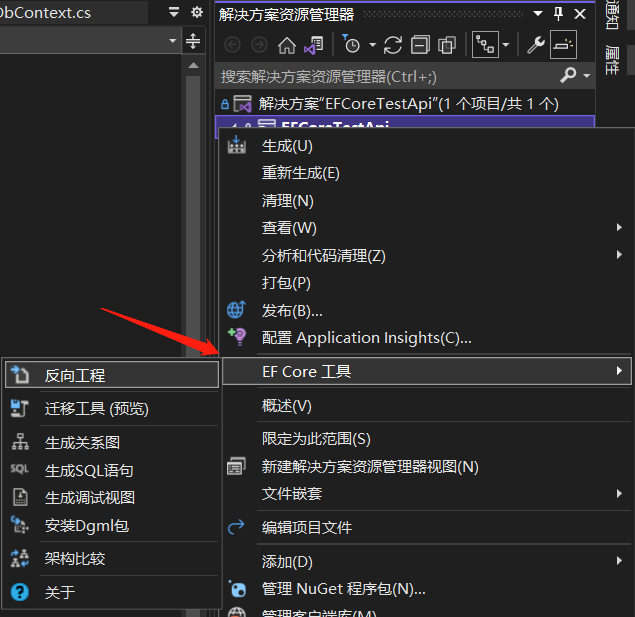

# EFCore 的 DbFirst 模式

[[toc]]


## 1 前言

EF6 时代，可以通过界面操作，添加数据库实体。

EF Core 需要通过 CLI 来进行该操作，具体请参考[EF Core官方文档：反向工程](https://docs.microsoft.com/zh-cn/ef/core/managing-schemas/scaffolding?tabs=dotnet-core-cli)。

当然，EF Core 也有界面化操作的工具，EF Core Power Tools，具体请见最后介绍。


## 2 前置条件

- [PMC 工具](https://docs.microsoft.com/zh-cn/ef/core/cli/powershell)（仅限 Visual Studio）或 [CLI 工具](https://docs.microsoft.com/zh-cn/ef/core/cli/dotnet)。

- 核心 NuGet 包：Microsoft.EntityFrameworkCore.Design

- 还需要为要进行反向工程的数据库架构安装适当的[数据库提供程序](https://docs.microsoft.com/zh-cn/ef/core/providers/)


## 3 主命令

```bash
dotnet ef dbcontext scaffold "[数据库连接串]" [提供程序]
```

如：

```bash
dotnet ef dbcontext scaffold "server=localhost;database=efcore;uid=sa;pwd=Qwe123456;" Microsoft.EntityFrameworkCore.SqlServer
```


## 4 命令参数

#### 4.1 生成指定表（--table）

上述命令，会生成整个数据库的表，如果需要指定特定的表，需要使用如下：

```bash
dotnet ef dbcontext scaffold "[数据库连接串]" [提供程序] --table table_name1 --table table_name2
```

#### 4.2 保留数据库名称（--use-database-names）

默认情况会修正表/列名，使用该参数尽量保留原名称。

```bash
-UseDatabaseNames    #PMC
--use-database-names #.NET Core CLI
```

#### 4.3 Fluent API 和数据注释（--data-annotations）

默认情况下，使用 Fluent API 配置实体类型。使用下面的命令，可以改为使用数据注释。

```bash
-DataAnnotations   #PMC
--data-annotations #.NET Core CLI
```

Fluent API

```csharp
entity.Property(e => e.Title)
    .IsRequired()
    .HasMaxLength(160);
```

数据注释

```csharp
[Required]
[StringLength(160)]
public string Title { get; set; }
```

#### 4.4 指定 DbContext 名称（--context）

指定将生成的 DbContext 类的名称

```bash
-Context  #PMC
--context #.NET Core CLI
```

#### 4.5 指定保存目录（--context-dir 和 --output-dir）

```bash
-ContextDir Data -OutputDir Models     #PMC
--context-dir Data --output-dir Models #.NET Core CLI
```

#### 4.6 指定命名空间（--namespace 和 --context-namespace）

```bash
-Namespace Your.Namespace -ContextNamespace Your.DbContext.Namespace    #PMC
--namespace Your.Namespace --context-namespace Your.DbContext.Namespace #.NET Core CLI
```


## 5 测试

数据库：SQL Server2019

程序： .NET6.0 的控制台程序

### 5.1 数据库准备

由于是 DbFirst，所以这里我们先创建一个数据库，名为 efcore

新建一张表 Test

```sql
CREATE TABLE [dbo].[Test](
	[Id] [uniqueidentifier] NOT NULL,
	[Name] [nvarchar](128) NULL,
 CONSTRAINT [PK_Test] PRIMARY KEY CLUSTERED 
(
	[Id] ASC
)WITH (PAD_INDEX = OFF, STATISTICS_NORECOMPUTE = OFF, IGNORE_DUP_KEY = OFF, ALLOW_ROW_LOCKS = ON, ALLOW_PAGE_LOCKS = ON) ON [PRIMARY]
) ON [PRIMARY]
```

### 5.2 新建一个控制台程序

这里命名为：DbFirstTest

```bash
mkdir DbFirstTest & cd DbFirstTest #新建文件夹DbFirstTest并切换至该目录下
dotnet new console -f net6.0       #新建.NET6.0控制台程序
```

### 5.3 引入 Nuget 包

```bash
# 引入 EF Core 核心包
dotnet add package Microsoft.EntityFrameworkCore.Design -v 6.0.4
# 引入 SQL Server 提供程序
dotnet add package Microsoft.EntityFrameworkCore.SqlServer -v 6.0.4
```

### 5.4 执行 Scaffold 命令

在控制台程序的根目录下，执行命令（连接串请自行修改成自己的）：

```bash
dotnet ef dbcontext scaffold "server=localhost;database=efcore;uid=sa;pwd=Qwe123456;" Microsoft.EntityFrameworkCore.SqlServer --data-annotations --context EfCoreContext --context-dir Data --output-dir Models
```

--data-annotations：数据注释在实体上

--context EfCoreContext：上下文指定命名为 EfCoreContext

--context-dir Data：上下文保存在根目录的 Data 文件夹下  

--output-dir Models：实体保存在根目录的 Models 文件夹下 

### 5.5 测试源码

在 Program.cs 添加测试代码：

```csharp
using DbFirstTest.Data;
using DbFirstTest.Models;

EfCoreContext db = new EfCoreContext();
Test test = new Test()
{
    Id = Guid.NewGuid(),
    Name = "Add"
};
db.Tests.Add(test);
db.SaveChanges();
Console.WriteLine("Add Successful！");
```

在项目根目录下，执行：

```bash
dotnet build #编译
dotnet run   #运行
```

执行以后，可以看到，数据库中添加了相应的记录。

### 5.6 源码

Gitee：https://gitee.com/lisheng741/testnetcore/tree/master/EFCore/DbFirstTest

Github：https://github.com/lisheng741/testnetcore/tree/master/EFCore/DbFirstTest


## 6 EF Core Power Tools

开源的 EF Core 界面工具，可以作为一个 vs 的插件，在 vs 里运作。

项目 Github 地址：[https://github.com/ErikEJ/EFCorePowerTools/](https://github.com/ErikEJ/EFCorePowerTools/)

VS 插件下载：[https://marketplace.visualstudio.com/items?itemName=ErikEJ.EFCorePowerTools](https://marketplace.visualstudio.com/items?itemName=ErikEJ.EFCorePowerTools)

在 VS 插件市场下载以后，安装即可。

本人的 vs 版本是 vs2022，安装以后，右键项目多了一个选项【EF Core工具】，点击【反向工程】即可进行 DbFirst 的相关操作了。

界面化操作比较直观，这里不在赘述。




## 参考来源

[EF Core官方文档：反向工程](https://docs.microsoft.com/zh-cn/ef/core/managing-schemas/scaffolding?tabs=dotnet-core-cli)