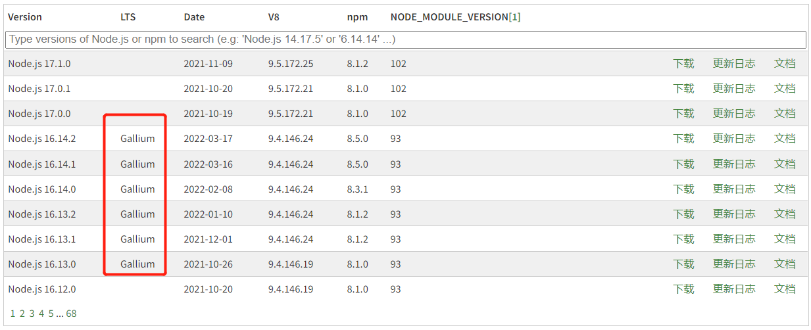

# node-相关工具安装

[[toc]]


## node 安装

[node 中文文档](http://nodejs.cn/learn)

> node 是一个基于 chrome V8 引擎的 JavaScript 运行环境；一个让 JavaSrcipt 运行在服务端的开发平台；简单的说，node 就是运行在服务端的 JavaScript。

按 node 中文文档的介绍，node 可以用来写后端，但一般不会真的用来开发后端。

个人感觉，在前端工程化中，node 更多时候承担一个开发环境的角色；在前端调试时，也承担 web 服务器的角色。

### 1 下载安装

下载最新【长期维护版本（LTS）】（截止至2022-4-2最新LTS为 16.14.2）

根据系统选择安装包，Windows 选择 `.msi`，可以傻瓜式安装，很方便。

[下载地址（国内）](http://nodejs.cn/download/)

[下载地址](https://nodejs.org/zh-cn/download/)

### 2 查看是否安装

查看 node 是否安装成功

```shell
node -v
```

查看 npm 是否安装成功

```shell
npm -v
```

### 3 node 历史版本下载

[node 历史版本](https://nodejs.org/zh-cn/download/releases/)

LTS 列有值的版本，为长期维护版本。




## 安装 nvm

> 用于管理 node 版本

由于 node 版本经常会出现一些玄学一般的事，有时候一些旧代码不兼容高版本的 node，一般又不可能把整个工程的东西都升级（这样确实费力不讨好，还可能引发其他问题），这时一般就需要把 node 版本切换到旧代码能兼容的 node 版本。

而 nvm 的作用，就是让我们本地可以装多个 node 版本，进而进行切换。

### 1 下载安装

**注意：** 安装路径不能有空格

[下载地址](https://github.com/coreybutler/nvm-windows/releases)

下载最新的 `nvm-setup.zip` 解压安装

###  2 查看是否安装

```shell
nvm version
#nvm   #这个也可以，还会显示所有可用命令
```

### 3 安装其他版本 node

[node 历史版本](https://nodejs.org/zh-cn/download/releases/)

```shell
nvm install v10.0.0  #安装v10.0.0版本node
```

### 4 切换 node 版本

```shell
nvm use 10.0.0
```

### 5 查看当前所有 node 版本

```shell
nvm list
```

### 6 切换 nvm 镜像

nvm 默认用的是 node.js 官网的下载，比较慢，可以切换成国内淘宝镜像服务器。

在 nvm 的安装路径下，找到 settings.txt，打开文件，在后面添加两行。

```shell
node_mirror: https://npmmirror.com/mirrors/node/
npm_mirror: https://npmmirror.com/mirrors/npm/
```


## 切换 npm 镜像，或安装 cnpm

> cnpm 是 npm 的一个插件，cnpm 用法和 npm 用法一致，只是执行命令的时候将 npm 改为 cnpm。
>
> 这样做的意义是：国内 npm 速度可能不行，cnpm 服务器在国内（淘宝团队）速度可能会好点。

**注意：**切换镜像，或安装 cnpm，二者选1即可，建议切换镜像，而不是安装 cnpm

### 切换 npm 镜像

切换成淘宝镜像

```shell
npm get registry  #查看当前镜像地址
npm config set registry http://registry.npmmirror.com/  #切换成淘宝的镜像
```

切换回原 npm 镜像

```shell
npm config set registry https://registry.npmjs.org/  #切回原来的镜像
```

### 安装 cnpm

```shell
npm install -g cnpm --registry=https://registry.npmmirror.com  #安装 淘宝镜像源 cnpm
```

### 安装 nrm

如果选择切换 npm 镜像，可以考虑装一个 nrm，用于管理切换

#### 1 安装

```shell
nrm install -g nrm
```

#### 2 使用

```shell
nrm ls  #查看可选源nrm use taobao  #切换
```

#### 3 其他操作

```shell
nrm add [registry] [url]  #添加，reigstry为源名，url为源的路径
nrm del [registry]  #删除
nrm test npm  #测试响应时间
```


## 其他工具

### yarn

> 用来替换 npm

一开始的时候 npm 各种问题，然后就出来了 yarn 解决 npm 的问题，再后来 npm 的功能也向 yarn 靠拢了。

### webpack

```bash
npm install -g webpack
npm install -g webpack-cli
```

mark：webpack 官方不推荐全局安装 webpack