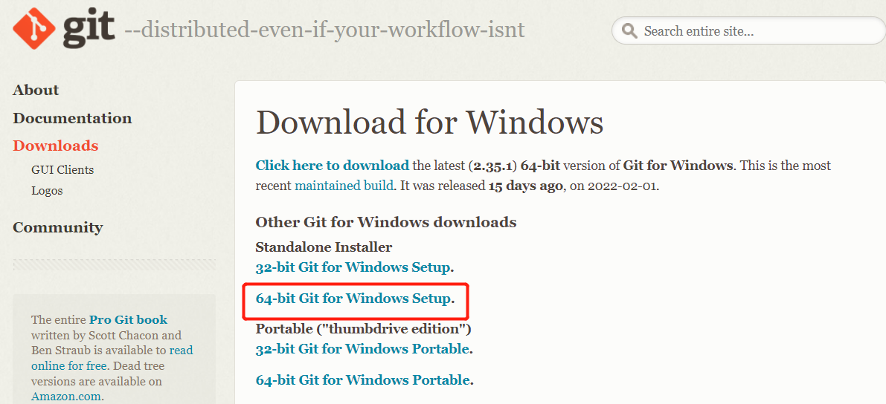
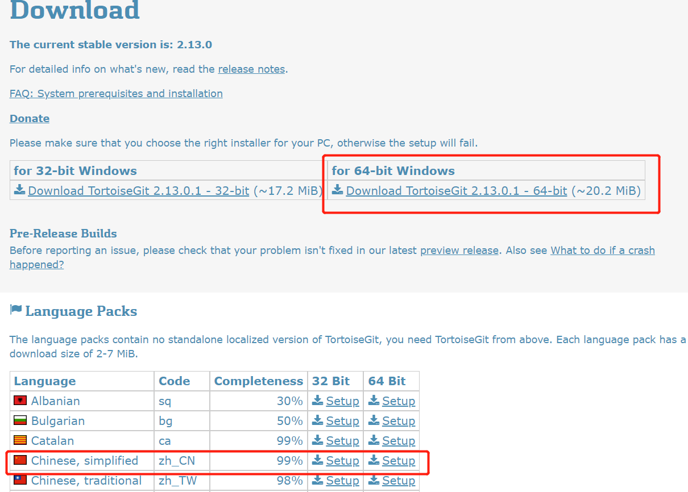
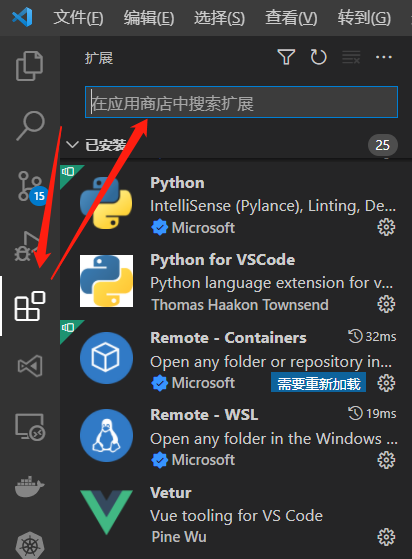

# 前端-开发环境搭建

[[toc]]


## 1 代码托管

如果开发工具使用 vs code，vs code 其实有集成 git 插件，也可以不安装。个人使用习惯是安装一下，方便很多。

**安装两个东西：** Git（代码管理）、TortoiseGit（辅助软件，界面化操作Git）

### 1.1 Git

[Git下载地址](https://git-scm.com/download/win)



### 1.2 TortoiseGit

[TortoiseGit 下载地址](https://tortoisegit.org/download/)

下载安装包，以及中文语言包




## 2 前端

开发工具（IED）：vs code

node 环境，相关工具（npm、nvm），vue框架相关安装（vue-cli）

### 2.1 vs code

[官方下载地址](https://code.visualstudio.com/Download)

官网下载慢可以用百度盘：链接：https://pan.baidu.com/s/1oYMEuKUy9QS6U5HkBvbzPg  提取码：6666

一般下载【System Installer】

在扩展中，搜索并安装插件：Vetur、EditorConfig、ESLint、vscode-icons



### 2.2 node 环境

参考：[node-相关工具安装](./node-相关工具安装.md)

#### 2.2.1 下载 node

下载最新【长期维护版本（LTS）】（截止至2022-4-2最新LTS为 16.14.2）

根据系统选择安装包，Windows 选择 `.msi`，可以傻瓜式安装，很方便。

[下载地址（国内）](http://nodejs.cn/download/)

[下载地址](https://nodejs.org/zh-cn/download/)

安装完 node 后，打开控制台（win键 + R：敲入 CMD），输入下面的命令校验 node 安装是否成功：

```bash
node -v
```

如显示版本号，则为安装成功。

#### 2.2.2 nvm（node 版本管理，可不装）

建议：先不装，以后有需要再装。

**注意：** 安装路径不能有空格

[下载地址](https://github.com/coreybutler/nvm-windows/releases)

下载最新的 `nvm-setup.zip` 解压安装

#### 2.2.3 切换 npm 镜像

国内 npm 速度可能不行，最好切换成国内的镜像，速度可能会好点。

在控制台输入下面的指令切换 npm 镜像：

```shell
npm config set registry http://registry.npm.taobao.org/
```

查看当前 npm 镜像

```shell
npm get registry
```

#### 2.2.4 安装 vue-cli

[vue 脚手架官方文档](https://cli.vuejs.org/zh/guide/installation.html)

全局安装，在命令窗口输入以下命令：

```shell
npm install -g @vue/cli
```


## 3 文档（可选）

语法：Markdown

工具：Typora（已收费，89元终生免费）、Mark Text（开源免费）

工具选择一个下载即可

### 3.1 Typora

下载链接：https://pan.baidu.com/s/1rehN8Oj41TLDbx-HumfCeQ 提取码：6666

下载【0.11.18】（最后一个免费版本）

### 3.2 Mark Text

自行百度

### 3.3 基本 Markdown 语法（基于 Typora）

```bash
CTRL + 数字1-6  #对应1-6级标题
CTRL + 0       #正文
> + 空格        #引用
```（table键上方的键，按3次） #代码块
CTRL + B       #加粗
```

