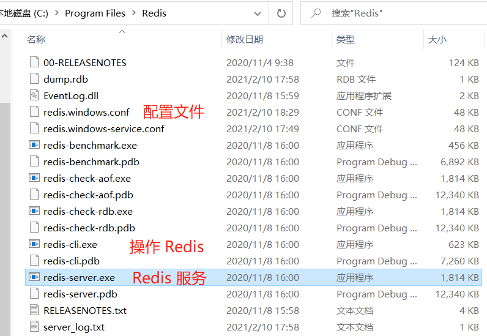

# windows 安装 Redis5.0

[[toc]]


## 下载安装

[下载地址](https://github.com/tporadowski/redis/releases)

这里下载的是 Redis-x64-5.0.10.msi

直接安装，安装过程勾选添加环境变量，其他都 next

安装可以参考：[windows 下安装 Redis](https://blog.csdn.net/leisure_life/article/details/82078233)

默认安装路径为 `C:\Program Files\Redis`

默认端口：6379

**安装目录文件：**



 

## 运行 Redis

安装目录下，输入运行命令行：

```bash
redis-server.exe redis.windows.conf
```

这句命令的意思是使用 `redis.windows.conf` 的配置启动 redis。

注意：windows 下首次运行可能会失败，具体请看下面的解决方案


 

## 设置密码

可以参考：[redis如何设置密码](https://blog.csdn.net/qq_42815754/article/details/83827375)

### 1 cli 修改

在安装目录下，输入以下命令

```bash
redis-cli.exe

#成功进入 redis-cli 以后，输入：
config set requirepass 123456
```

这里将密码设置为 123456

密码设置之后，当你退出再次连上redis的时候，就需要输入密码了，不然是无法操作的。

**注：这种方式设置密码，每次重启计算机密码就失效**

### 2 配置文件修改 

修改配置文件 redis.windows.conf

```bash
# requirepass foobared
requirepass 123456
```

之后启动 redis 以这个配置文件启动：

```bash
redis-server.exe redis.windows.conf
```

 

## 设置密码以后如何进入 Redis

方式1：进入 redis-cli.exe 时，附带密码

```
redis-cli.exe -a 123456
```

方式2：进入以后，再输入密码验证

```bash
redis-cli.exe

#进入 redis-cli 以后，输入：
auth 123456
```

 

## 有可能出现的坑

### 1 运行失败的情况

如图，首次运行的时候出现了：

[18756] 10 Feb 17:55:53.864 # Could not create server TCP listening socket 127.0.0.1:6379: bind: 操作成功完成。


**解决方法**

在安装目录下，分步输入以下命令

```bash
redis-cli.exe
shutdown
exit
```

然后重新输入运行命令：

```bash
redis-server.exe redis.windows.conf
```

### 2 进入 redis-cli.exe 时报错

**提示**：Could not connect to Redis at 127.0.0.1:6379: 由于目标计算机积极拒绝，无法连接。

**原因**：没有打开 Redis 服务

**解决1**：在安装目录下，输入运行命令行：redis-server.exe redis.windows.conf

**解决2**：在安装目录下，直接双击运行：redis-server.exe

### 3 没有目录读写权限报错

主要报错信息：Permission denied

完整报错信息：

```bash
[21816] 28 Apr 09:08:19.093 # rdbSave failed in qfork: Permission denied
[31096] 28 Apr 09:08:19.146 # fork operation complete
[31096] 28 Apr 09:08:19.154 # Background saving error
[31096] 28 Apr 09:08:25.064 * 1 changes in 900 seconds. Saving...
[31096] 28 Apr 09:08:25.071 * Background saving started by pid 27060
[27060] 28 Apr 09:08:25.134 # Failed opening the RDB file dump.rdb (in server root dir C:\Program Files\Redis) for saving: 数据无效。
```

该报错的大概意思是：RDB 保存的时候，报了没有权限的错（Permission denied），文件所在的目录是 C:\Program Files\Redis

**解决**：给该目录分配当前用户的读写权限。


## 安装为 Windows 服务

```bash
redis-server.exe --service-install redis.windows.conf
```


## 参考来源

[Hank 的 [已解决]报错: Creating Server TCP listening socket 127.0.0.1:6379: bind: No error](https://www.cnblogs.com/hankleo/p/11751440.html )

[浪丶荡 的 下载并安装windows版本的Redis](https://blog.csdn.net/leisure_life/article/details/82078233)

[凉凉的西瓜 的 redis如何设置密码](https://blog.csdn.net/qq_42815754/article/details/83827375)

[windows下安装Redis并部署成服务](https://www.cnblogs.com/weiqinl/p/6490372.html)

