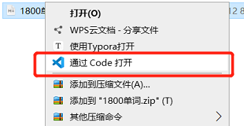
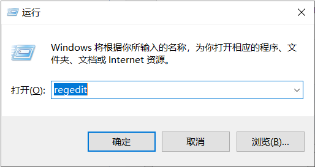
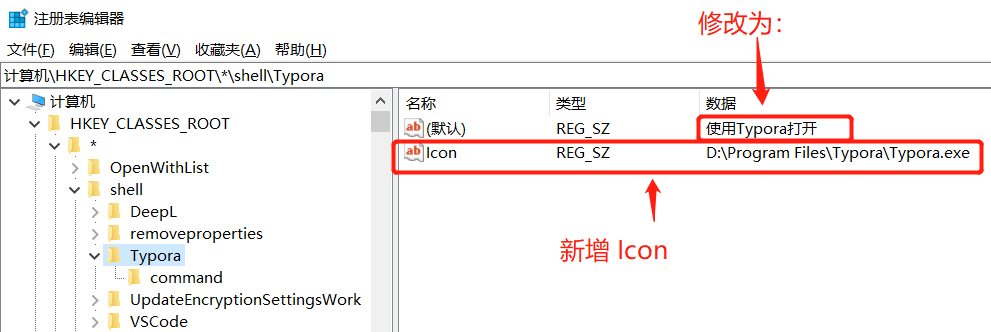
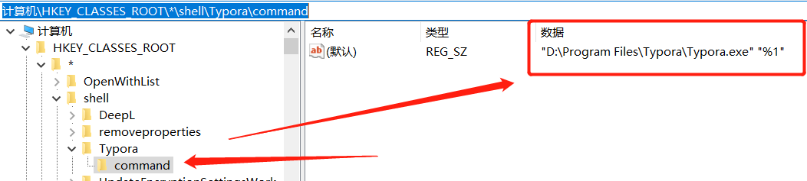
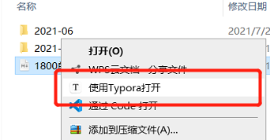

# 添加windows右键菜单：使用exe应用程序打开文件/文件夹 

[[toc]]


## 前言

VS Code 安装的时候，可以勾选【将‘通过Code打开’操作添加到 Windows 资源管理器文件上下文菜单】。

勾选并安装以后，右键文件和文件夹就多了一个菜单选项，如图



 其他应用程序也可以实现类似的效果。

这里以Typora为例。


## 如何添加windows右键菜单

### 1 针对文件添加

#### 1.1 打开注册表

win键 + R 打开运行窗口，输入 regedit



#### 1.2 修改注册表

```bash
# 注册表路径
计算机\HKEY_CLASSES_ROOT\*\shell

# 添加节点
【右键】shell节点 -> 新建(N) -> 项(K) -> 【命名】Typora

# 修改 Typora 节点注册表
1. 修改（默认）的数据：使用Typora打开
2. 新增一个 字符串值 的类型，命名Icon，设置数据为：D:\Program Files\Typora\Typora.exe
```



```bash
# 添加节点
【右键】Typora -> 新建(N) -> 项(K) -> 【命名】command

# 修改 Typora\command 注册表值
修改（默认）的数据为："D:\Program Files\Typora\Typora.exe" "%1"
```



#### 1.3 效果

右键文件，多了一个菜单，且可以正常打开文件：




### 2 对文件夹添加

对文件夹添加的方式，与对文件添加方式基本一致，只是注册表的路径有变

```bash
# 对文件夹添加注册表地址：
计算机\HKEY_CLASSES_ROOT\Directory\shell

# 文件夹背景右键菜单（这个配置了不生效，应该还少什么）：
计算机\HKEY_CLASSES_ROOT\Directory\Background\shell
```

command 注册表值

```bash
# 修改 Typora\command 注册表值
修改（默认）的数据为："D:\Program Files\Typora\Typora.exe" "%V"
```

注：Background 那个怎么设置都死活不生效……


## 补充

这里解释一下 command 程序路径后面的 "%1" 和 "%V" 是什么意思。

%1 和 %V 都是注册表的参数

| 参数 | 含义                   |
| :--: | :--------------------- |
|  %1  | 文件路径               |
|  %2  | 系统默认的打印机       |
|  %3  | 文件扇区               |
|  %4  | 端口                   |
|  %D  | 文件路径               |
|  %L  | 文件长路径             |
|  %V  | 文件路径               |
|  %W  | 当前文件的父目录的路径 |


## 参考来源

[windows注册表参数(%1,%2,%v)](https://blog.csdn.net/apkjdk/article/details/105589987)